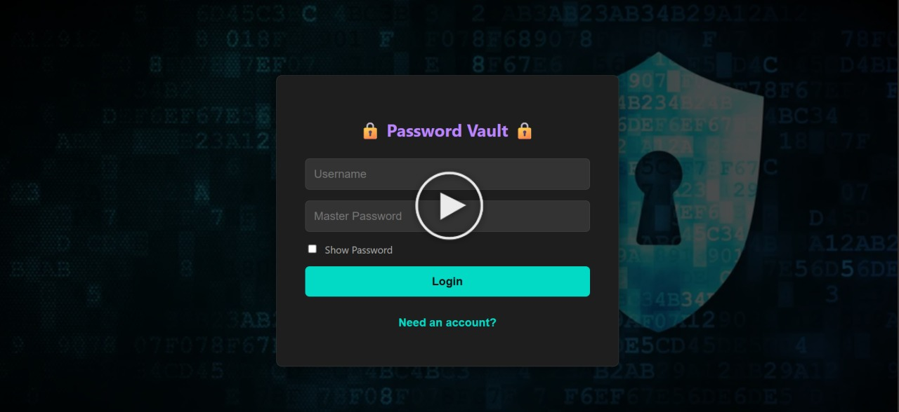
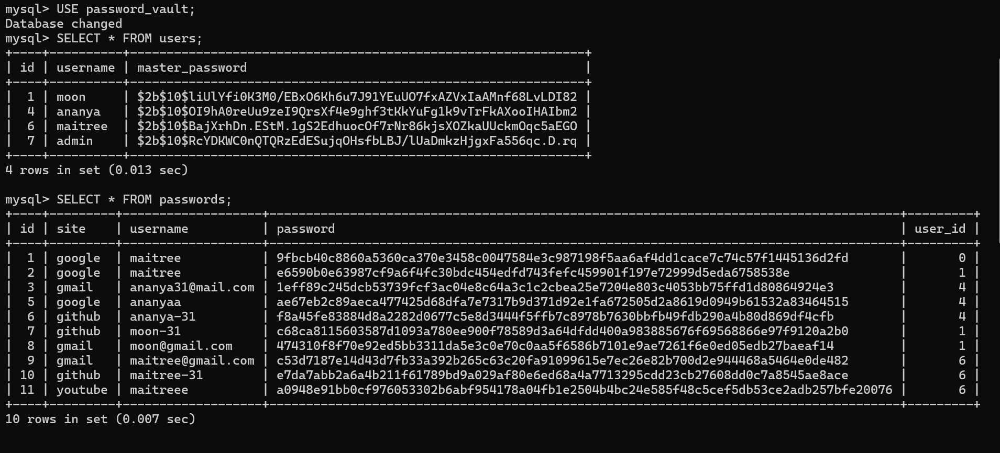

# 🔒 Secure Password Vault 

A full-stack, secure password manager built with Node.js, Express, React, and MySQL. This application features end-to-end security with user authentication, password hashing, and credential encryption.

[](./assets/demo.mp4)

---

## ✨ Features

- **User Authentication:** Secure user registration and login with a Master Password.
- **Credential Management:** Full CRUD (Create, Read,Update, Delete) functionality for passwords.
- **Secure Storage:** All sensitive data is hashed and encrypted before being stored.
- **Master Password Verification:** Sensitive actions like viewing or deleting a password require re-authentication.
- **Clean, Responsive UI:** A modern, dark-themed interface for easy management.

---

## 🛡️ Security Features

This project was built with a security-first approach, implementing the following measures:

- **Password Hashing:** Master passwords are not stored in the database. Instead, they are hashed using **bcrypt**, which includes a salt to protect against rainbow table attacks.
- **Data Encryption:** All stored credentials are encrypted at rest using **AES-256-GCM**, an authenticated encryption algorithm that ensures both confidentiality and integrity.
- **Secure Key Derivation:** The encryption key is derived from a user-provided password and a unique salt using **scrypt**, a memory-hard key derivation function designed to resist brute-force attacks.
- **Authorization:** API endpoints are protected using **JSON Web Tokens (JWTs)**. This ensures that a user can only ever access their own data.

### How Your Data is Stored

Security isn't just a claim. The database tables below show how your data is protected:

1.  **`users` table:** Master passwords are **hashed** using bcrypt. The `master_password` column shows the hash, not the plain text password.
2.  **`passwords` table:** Credentials are **encrypted** using AES-256. The `password` column contains unreadable encrypted text, not the user's saved password.



---

## 🛠️ Tech Stack


---

## 🚀 Getting Started

### Prerequisites

- Node.js
- MySQL Server

### Running the Project Locally

This project is a full-stack application with two main parts: the backend server and the frontend React app. You will need to run them in two separate terminals.

1.  **Get the Code**
    Get a local copy of the project by cloning it.
    ```bash
    git clone [https://github.com/maitreesharmaa/secure-password-vault.git](https://github.com/maitreesharmaa/secure-password-vault.git)
    cd secure-password-vault
    ```

2.  **Launch the Backend (Terminal 1)**
    In your first terminal, navigate to the `backend` folder, install its dependencies, and start the server.
    ```bash
    # Go into the backend folder
    cd backend
    
    # Install all server-side dependencies
    npm install
    
    # IMPORTANT: Create a .env file and add your database/secret variables
    
    # Start the server
    node server.js
    ```

3.  **Launch the Frontend (Terminal 2)**
    Open a *second* terminal. From the root project folder (`secure-password-vault`), navigate to the `frontend`, install its dependencies, and start the app.
    ```bash
    # From the main 'secure-password-vault' folder
    cd frontend
    
    # Install all React dependencies
    npm install
    
    # Start the React app (this will open it in your browser)
    npm start
    ```
